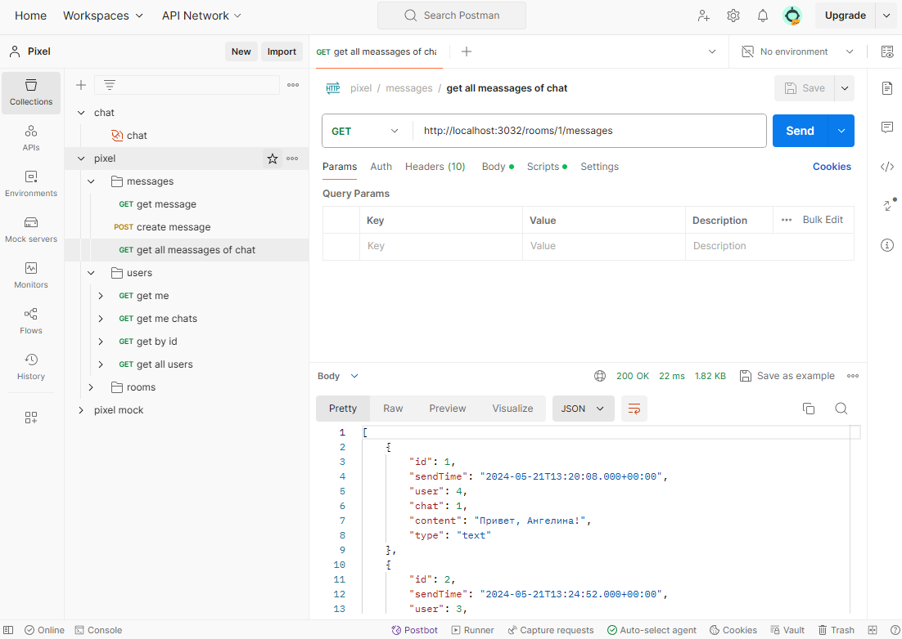
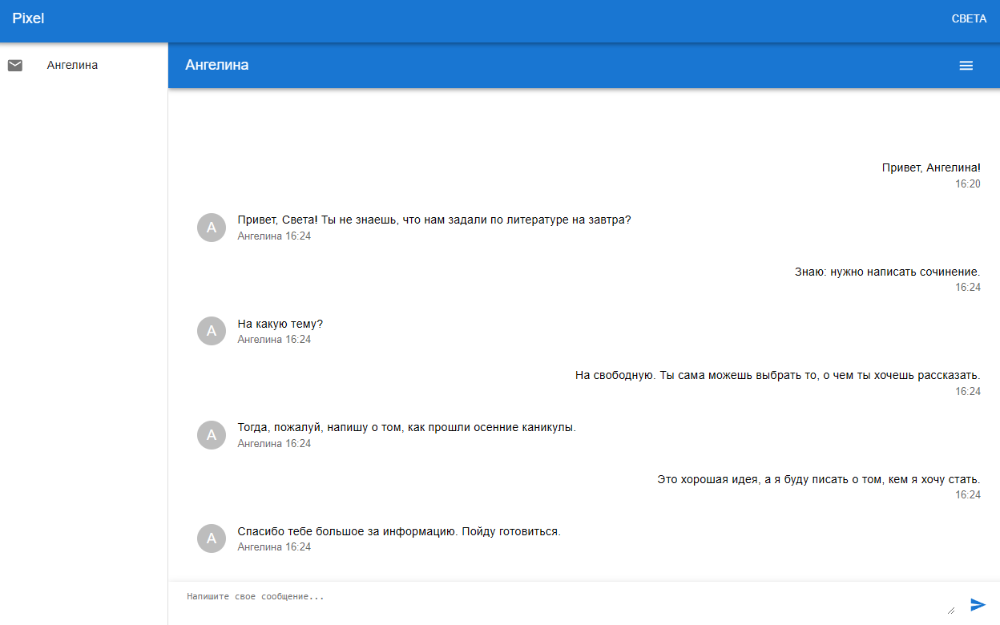

# Pixel

[![codecov][codecov-badge]][codecov] 

 

[codecov]: https://codecov.io/gh/ara2003/Pixel
[codecov-badge]: https://codecov.io/gh/ara2003/Pixel/graph/badge.svg?token=O27IAHGH7E

<!--  -->
<!--  -->

## Технологии

## Пользовательский интерфейс

### Авторизация

### Вступление в чат

 
### Изменение сообщений

### Отправка

### Профиль

### Работа с чатами

